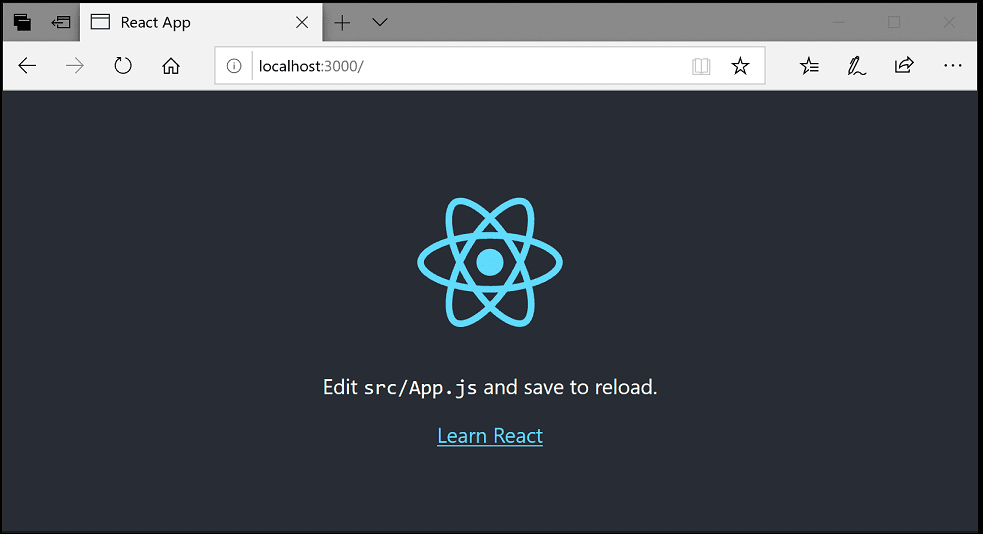

# Creating a new React project with TypeScript

In this section, we will create a new React project with TypeScript using the `create-react-app` tool. This tool allows us to quickly set up a new React project with all the necessary configurations and dependencies.

:arrow_right: Follow the steps described [here](INSTALL%20AND%20SETUP.md#set-up-a-react-project) to create a new React project with TypeScript.

Once you have set up the project, you can test it by running the development server and opening the application in your web browser.

```bash
npm start
```

This will start the development server and open the application in your default web browser.

<details>
  <summary>You should see the default React application running with TypeScript.</summary>
    
</details>

Now that we have set up the project, we need to setup Tailwind CSS for styling the application. We will cover this in the next section.

# Integrating Tailwind CSS for styling

In this section, we will integrate Tailwind CSS into our React project to style the application. Tailwind CSS is a utility-first CSS framework that allows us to quickly build custom designs without writing any CSS.

:arrow_right: Follow the steps described [here](INSTALL%20AND%20SETUP.md#integrate-tailwind-css) to integrate Tailwind CSS into your React project.

> [!NOTE]
> [Tailwind CSS Documentation](https://tailwindcss.com/docs) is a great resource you gonna need to refer to while working with Tailwind CSS.


# Creating the login and register pages

Now that we have set up our React project with TypeScript and integrated Tailwind CSS, let's create our first pages.

1. Install React Router ``npm install react-router-dom``  
2. Create a new folder named `pages` inside the `src` directory.  
3. Inside the pages folder, create two new files named `Login.tsx` and `Register.tsx`.

:arrow_right: Follow the steps described [here](INSTALL%20AND%20SETUP.md#set-up-react-router) to set up React Router.

## Login page

:checkered_flag: __Objectives of the login page__:
- Create a form with email and password fields
- Add validation for the form fields (e.g., required, email format)
- Handle form submission and display success or error messages


> [!TIP]
> Use the `useState` hook to manage the form state.  
> Use ``axios`` to make requests to the backend. [How to use axios?](USEFUL%20RESOURCES.md#axios).

> [!TIP]
> [How to save the user's authentication state?](USEFUL%20RESOURCES.md#how-to-save-the-users-authentication-state)

<details>
  <summary>If you need help, you can refer to the following example (SPOILER).</summary>

  ```tsx
    import React, { useState } from 'react';

    const Login: React.FC = () => {
      const [email, setEmail] = useState('');
      const [password, setPassword] = useState('');
      const [error, setError] = useState('');

      const handleSubmit = (e: React.FormEvent) => {
        e.preventDefault();
        if (!email || !password) {
          setError('Please enter your email and password.');
        } else {
          // Handle form submission (e.g., make a request to the backend with axios)
          // ...
        }
      };

      return (
        <div>
          <h1>Login</h1>
          {error && <p>{error}</p>}
          <form onSubmit={handleSubmit}>
            <div>
              <label htmlFor='email'>Email</label>
              <input
                type='email'
                id='email'
                value={email}
                onChange={(e) => setEmail(e.target.value)}
              />
            </div>
            <div>
              <label htmlFor='password'>Password</label>
              <input
                type='password'
                id='password'
                value={password}
                onChange={(e) => setPassword(e.target.value)}
              />
            </div>
            <button type='submit'>Login</button>
          </form>
        </div>
      );
    };

    export default Login;
  ```
</details>

> [!TIP]
> [How to style your page using Tailwind CSS?](USEFUL%20RESOURCES.md#how-to-style-using-tailwind-css)


## Register page

:checkered_flag: __Objectives of the register page__:
- Create a form with email, password, and confirm password fields
- Add validation for the form fields (e.g., required, email format, password match)
- Handle form submission and display success or error messages

<details>
  <summary>If you need help, you can refer to the following example (SPOILER).</summary>

  ```tsx
    import React, { useState } from 'react';

    const Register: React.FC = () => {
      const [email, setEmail] = useState('');
      const [password, setPassword] = useState('');
      const [confirmPassword, setConfirmPassword] = useState('');
      const [error, setError] = useState('');

      const handleSubmit = (e: React.FormEvent) => {
        e.preventDefault();
        if (!email || !password || !confirmPassword) {
          setError('Please enter your email, password, and confirm password.');
        } else if (password !== confirmPassword) {
          setError('Passwords do not match.');
        } else {
          // Handle form submission (e.g., make a request to the backend with axios)
          // ...
        }
      };

      return (
        <div>
          <h1>Register</h1>
          {error && <p>{error}</p>}
          <form onSubmit={handleSubmit}>
            <div>
              <label htmlFor='email'>Email</label>
              <input
                type='email'
                id='email'
                value={email}
                onChange={(e) => setEmail(e.target.value)}
              />
            </div>
            <div>
              <label htmlFor='password'>Password</label>
              <input
                type='password'
                id='password'
                value={password}
                onChange={(e) => setPassword(e.target.value)}
              />
            </div>
            <div>
              <label htmlFor='confirmPassword'>Confirm Password</label>
              <input
                type='password'
                id='confirmPassword'
                value={confirmPassword}
                onChange={(e) => setConfirmPassword(e.target.value)}
              />
            </div>
            <button type='submit'>Register</button>
          </form>
        </div>
      );
    };

    export default Register;
  ```
</details>

# Home and not found pages

## Home page

:checkered_flag: __Objectives of the home page__:
- Create a simple home page with a welcome message and a link to the login page
- Add a navigation bar with links to the login and register pages

<details>
  <summary>If you need help, you can refer to the following example (SPOILER).</summary>

  ```tsx
    import React from 'react';
    import { Link } from 'react-router-dom';

    const Home: React.FC = () => {
      return (
        <div>
          <h1>Welcome to EpyTodo!</h1>
          <p>
            Please <Link to='/login'>login</Link> or <Link to='/register'>register</Link> to get started.
          </p>
        </div>
      );
    };

    export default Home;
  ```
</details>

## Not found page

:checkered_flag: __Objectives of the not found page__:
- Create a simple 404 page with a message indicating that the page was not found
- Add a link to the home page

<details>
  <summary>If you need help, you can refer to the following example (SPOILER).</summary>

  ```tsx
    import React from 'react';
    import { Link } from 'react-router-dom';

    const NotFound: React.FC = () => {
      return (
        <div>
          <h1>404 - Page Not Found</h1>
          <p>The page you are looking for does not exist.</p>
          <p>
            <Link to='/'>Go to the home page</Link>
          </p>
        </div>
      );
    };

    export default NotFound;
  ```
</details>


> [!TIP]
> _:sparkles: **Congratulations!** You have successfully created the login, register, home, and not found pages for your React application. Now you can customize the pages and add more features to your application or create a custom design using Tailwind CSS and [Heroicons](USEFUL%20RESOURCES.md#how-to-use-heroicons) icons. If you need help, you can refer to the [USEFUL RESOURCES](USEFUL%20RESOURCES.md) guide for more information and examples._