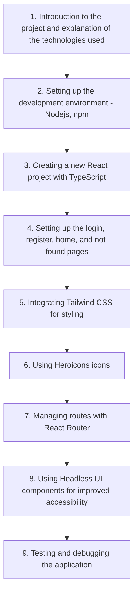

# Workshop Frontend EpyTodo - Part 1

> [!IMPORTANT]
> Participation in this part is necessary to access Part 2 of the Workshop.

> [!NOTE]
> If you haven't completed the EpyTodo Backend project, you can use the [EpyTodo backend project](../Backend/) provided to test the application.

Welcome to the **Workshop Frontend EpyTodo - Part 1**! In this first workshop, we will focus on <u>setting up a React project with TypeScript</u> and creating the login, register, home, and not found pages.

:checkered_flag: <u>Objectives of the workshop</u>:
- Set up a React project with TypeScript
- Create the login, register, home, and not found pages
- Utilize Tailwind CSS, Heroicons, and Headless UI for design and user interface

> [!CAUTION]
> :warning: <u>Prerequisites</u>:
> - Basic knowledge of _HTML_[^1], _CSS_[^2], and _JavaScript_[^3]
> - [Node.js](INSTALL%20AND%20SETUP.md#install-nodejs) installed on your system. [-> INSTALL AND SETUP GUIDE <-](INSTALL%20AND%20SETUP.md#install-nodejs)

:books: <u>Workshop content</u>:

Now that you have an overview of the workshop, let's [get started](SUBJECT.md)!

[^1]: [HyperText Markup Language](https://developer.mozilla.org/en-US/docs/Learn/HTML) - HTML is the standard markup language for documents designed to be displayed in a web browser.
[^2]: [Cascading Style Sheets](https://developer.mozilla.org/en-US/docs/Web/CSS) - CSS is a style sheet language used for describing the presentation of a document written in HTML.
[^3]: [JavaScript](https://developer.mozilla.org/en-US/docs/Web/JavaScript) - JavaScript is a programming language that enables interactive web pages and is an essential part of web applications.