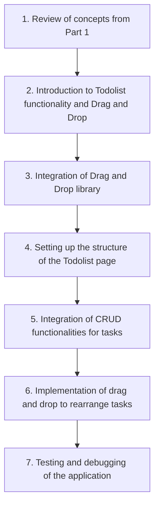

# Workshop Frontend EpyTodo - Part 2

> [!IMPORTANT]
> Completion of Part 1 is necessary to proceed with Part 2 of the Workshop.

Welcome to the **Workshop Frontend EpyTodo - Part 2**! In this continuation workshop, we will build upon the foundation laid in Part 1 and delve into more advanced functionalities for our EpyTodo application.

:checkered_flag: __Objectives of Part 2__:
- Integration of Drag and Drop
- Integration of CRUD functionalities for tasks

> [!CAUTION]
> :warning: __Prerequisites__:
> - Completion of [**Workshop Frontend EpyTodo - Part 1**](../part1/README.md)

:books: __Workshop content__:

Let's dive into the exciting world of Todolist functionality and Drag and Drop! [Begin Part 2](SUBJECT.md).
